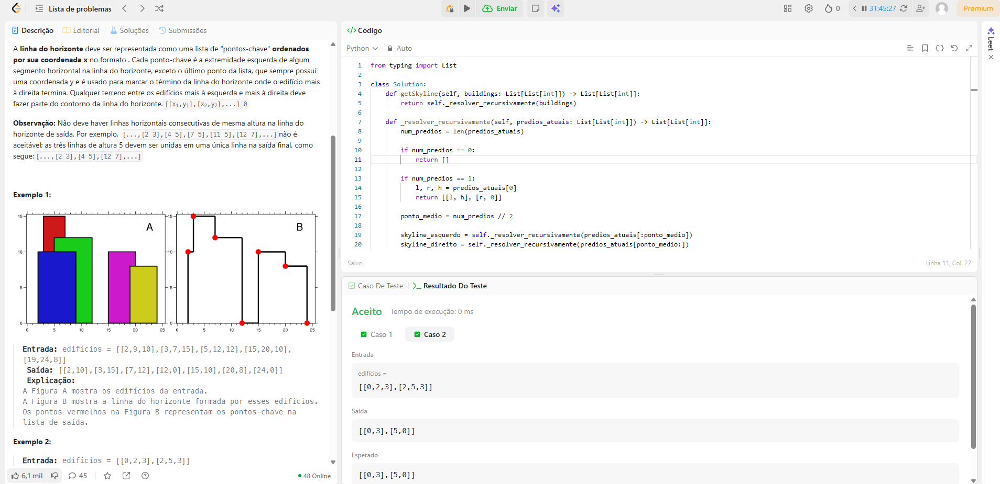
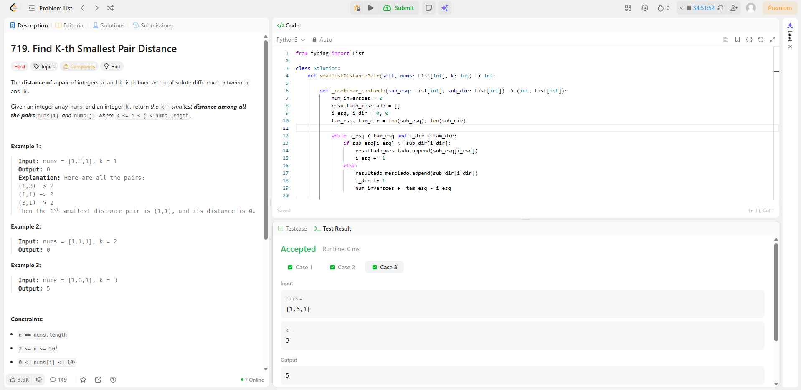

# Exercícios sobre Dividir e Conquistar

**Conteúdo da Disciplina**: Dividir e Conquistar 

## Alunos - Grupo 42

|Matrícula | Aluno |
| -- | -- |
| 22/1008445  | Samara Letícia Alves dos Santos |

## Sobre

Este é um repositório para armazenar soluções sobre problemas do módulo de dividir e conquistar no leetcode. 

## Screenshots
### 218. The Skyline Problem [Hard]

### 719. Find K-th Smallest Pair Distance [Hard]

## Apresentação

Vídeo disponível em: [youtube](https://youtu.be/uW1AgJSEeHM)
